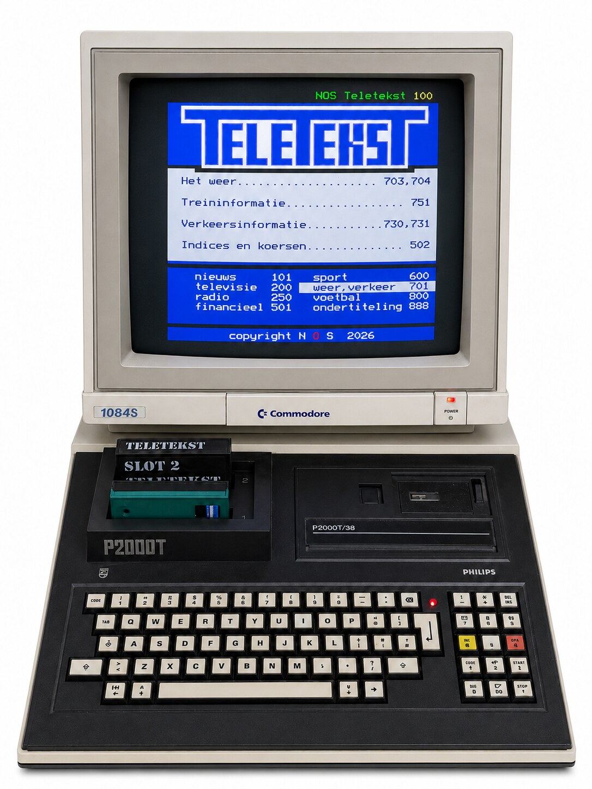
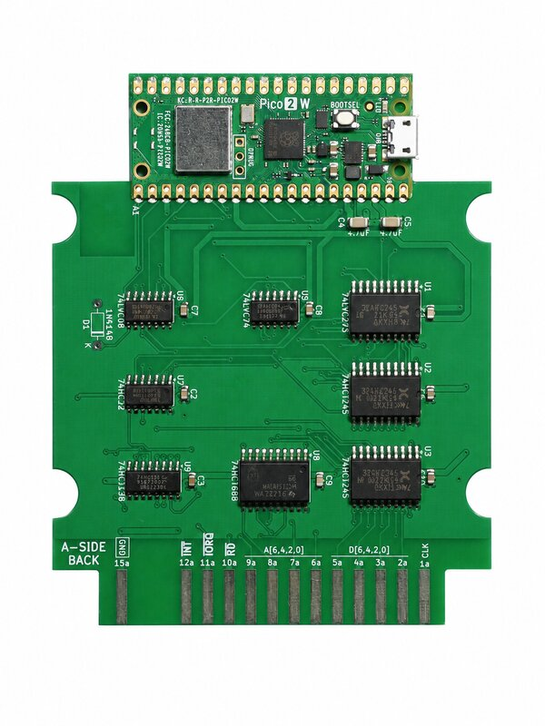

# P2000T Teletekst Cartridge

[](https://github.com/ifilot/p2000t-teletekst-cartridge/releases/latest)
[](https://github.com/ifilot/p2000t-teletekst-cartridge/actions/workflows/build-and-release.yml)
[](LICENSE)

<p align="center">
  
</p>

## Introduction

The P2000T Teletekst Cartridge brings internet-connected teletext to the Philips
P2000T. A slot-1 ROM provides the native SAA5050 user interface, while a
Raspberry Pi Pico W or Pico 2 W interface in slot 2 manages Wi-Fi and fetches
pages from either the NOS service or the P2000T community service. Together,
they provide wireless network setup, optional encrypted credential storage, and
direct three-digit page selection on the original computer.

This repository contains the public hardware and client side of the P2000T
Teletekst project:

- `src/` is the 16 KiB slot-1 cartridge client.
- `firmware/` is the Raspberry Pi Pico W firmware for the slot-2 interface.
- [`docs/protocol.md`](docs/protocol.md) defines the P2WP/2 link protocol
  between them.
- `pcb/` contains the KiCad hardware design and manufacturing files.
- `enclosure/` contains the enclosure and label models.

## Downloads

Download the latest release artifacts:

- [P2000T cartridge ROM (`p2wp-cartridge.bin`)](https://github.com/ifilot/p2000t-teletekst-cartridge/releases/latest/download/p2wp-cartridge.bin)
- [Raspberry Pi Pico W firmware (`p2wp-pico-w.uf2`)](https://github.com/ifilot/p2000t-teletekst-cartridge/releases/latest/download/p2wp-pico-w.uf2)
- [Raspberry Pi Pico 2 W firmware (`p2wp-pico-2-w.uf2`)](https://github.com/ifilot/p2000t-teletekst-cartridge/releases/latest/download/p2wp-pico-2-w.uf2)

## Hardware

<p align="center">
  
</p>

### Circuit schematic

<p align="center">
  <a href="pcb/p2000t-pico-web-interface.svg">
    
  </a>
</p>

## Documentation

[`docs/protocol.md`](docs/protocol.md) is the canonical P2WP/2 interface
specification. The Sphinx documentation adds implementation guides for
[P2000T BASIC](docs/basic.rst) and
[Z80 assembly](docs/assembly.rst).

Pushes to `master` publish the rendered documentation to
[GitHub Pages](https://ifilot.github.io/p2000t-teletekst-cartridge/). Manual
deployment is also available from the GitHub Actions page. Before the first
deployment, select **GitHub Actions** as the publishing source under
**Settings → Pages**.

Build the HTML documentation with:

```sh
python3 -m pip install -r docs/requirements.txt
make -C docs html
```

## Compilation

### Cartridge

Build the cartridge with `make -C src`. 

### PICO Firmware

Build the firmware with `cmake -S firmware -B firmware/build -G Ninja` followed
by `cmake --build firmware/build`; this requires `PICO_SDK_PATH` to point to a
Raspberry Pi Pico SDK.
