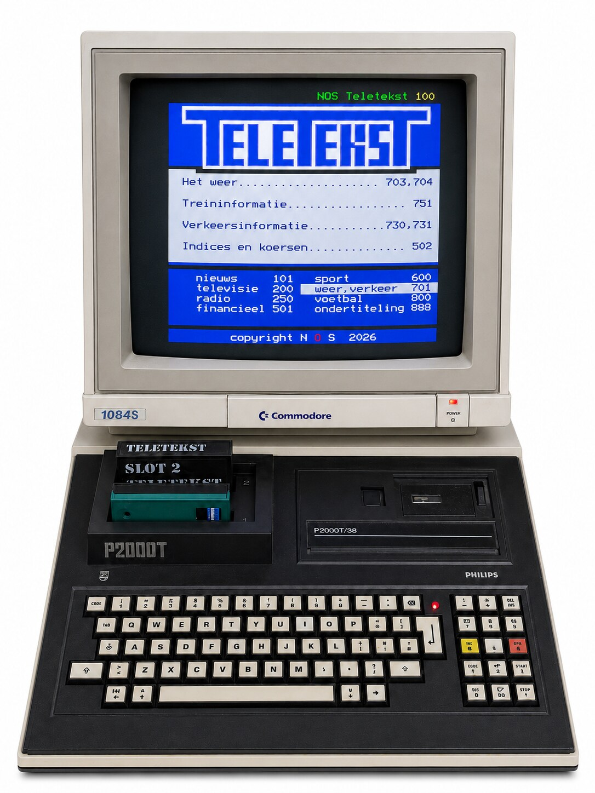
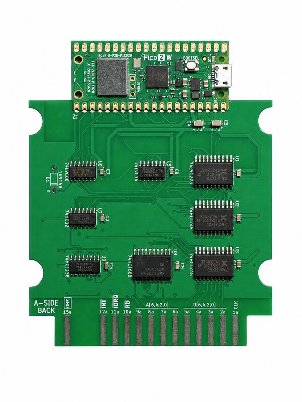

# P2000T Teletekst Cartridge

[](https://github.com/ifilot/p2000t-teletekst-cartridge/releases/latest)
[](https://github.com/ifilot/p2000t-teletekst-cartridge/actions/workflows/build-and-release.yml)
[](LICENSE)

<p align="center">
  
</p>

## Introduction

The P2000T Teletekst Cartridge brings internet-connected teletext to the Philips
P2000T. A slot-1 ROM provides the native SAA5050 user interface, while a
Raspberry Pi Pico W or Pico 2 W interface in slot 2 manages Wi-Fi and fetches
pages from the NOS service, the P2000T community service,
[TeletekstArchief.nl](https://teletekstarchief.nl), or a user-supplied HTTP(S)
server. Together, they provide wireless network setup, optional
encrypted credential storage, and direct three-digit page selection on the
original computer.

This repository contains the public hardware and client side of the P2000T
Teletekst project:

- `src/` is the 16 KiB slot-1 cartridge client.
- `firmware/` is the Raspberry Pi Pico W firmware for the slot-2 interface.
- [`docs/protocol.md`](docs/protocol.md) defines the P2WP/2–7 link protocol
  between them.
- [`docs/custom-server.md`](docs/custom-server.md) gives the small HTTP/JSON
  contract needed to host your own pages.
- [`server/`](server/) contains a dependency-free Python example server and
  editable test page.
- `pcb/` contains the KiCad hardware design and manufacturing files.
- `enclosure/` contains the enclosure and label models.

## Downloads

Download the latest release artifacts:

- [P2000T cartridge ROM (`p2wp-cartridge.bin`)](https://github.com/ifilot/p2000t-teletekst-cartridge/releases/latest/download/p2wp-cartridge.bin)
- [Raspberry Pi Pico W firmware (`p2wp-pico-w.uf2`)](https://github.com/ifilot/p2000t-teletekst-cartridge/releases/latest/download/p2wp-pico-w.uf2)
- [Raspberry Pi Pico 2 W firmware (`p2wp-pico-2-w.uf2`)](https://github.com/ifilot/p2000t-teletekst-cartridge/releases/latest/download/p2wp-pico-2-w.uf2)

## Installing the firmware

Download all required binaries from the [Downloads](#downloads) section. Turn
the P2000T off before inserting or removing either cartridge.

### Slot-1 cartridge ROM

`p2wp-cartridge.bin` is a raw, signed 16 KiB ROM image for the slot-1
Teletekst cartridge. The programming procedure depends on the ROM, EEPROM, or
flash cartridge being used:

1. Select the exact memory device fitted to the cartridge in its programmer or
   flashing software.
2. Load `p2wp-cartridge.bin` as a raw binary. Do not byte-swap or add a file
   header.
3. Erase the device first if its technology requires it, then program and
   verify all 16,384 bytes.
4. Disconnect the programmer and insert the cartridge into slot 1 while the
   P2000T is powered off.

If the cartridge has an integrated loader rather than a removable memory chip,
follow that cartridge's instructions and use `p2wp-cartridge.bin` as its ROM
image. Do not guess a memory-device setting: an incorrect programming voltage
or pin configuration can damage the device.

### Pico W or Pico 2 W

> [!IMPORTANT]
> The Pico W and Pico 2 W use different firmware images, and the module marking
> may be hidden inside the cartridge. When the BOOTSEL drive opens in File
> Explorer, identify the Pico by its drive name: `RPI-RP2` means Pico W and
> `RP2350` means Pico 2 W. Do not copy a firmware file until the drive name has
> been checked.

| Installed module | BOOTSEL drive | Firmware file |
| --- | --- | --- |
| Raspberry Pi **Pico W** (RP2040) | `RPI-RP2` | `p2wp-pico-w.uf2` |
| Raspberry Pi **Pico 2 W** (RP2350) | `RP2350` | `p2wp-pico-2-w.uf2` |

1. Turn off the P2000T. Leave it off throughout the update.
2. Connect a data-capable USB cable to the Pico while holding its **BOOTSEL**
   button, then release the button when the USB drive appears.
3. In File Explorer (or the equivalent file manager), check the BOOTSEL drive
   name against the table above to determine which Pico variant is installed.
4. Copy the matching `.uf2` file to that drive. The drive automatically ejects
   and the Pico reboots when programming is complete.
5. Unplug the USB cable, install the slot-2 cartridge if it was removed, and
   then power on the P2000T.

BOOTSEL is stored in the Pico's read-only boot ROM, so this update method
remains available even if an earlier firmware image does not start. See the
official [Raspberry Pi drag-and-drop instructions](https://www.raspberrypi.com/documentation/microcontrollers/c_sdk.html#your-first-binaries)
for more detail.

#### Pico W versus Pico 2 W performance

Both modules provide the same cartridge features and should feel the same in
normal use. Page loading is dominated by the shared CYW43439 wireless subsystem,
Internet and server latency, and the same negotiated P2WP cartridge transport, so the
Pico 2 W's faster processor is not expected to provide a noticeable benefit
here.

## Hardware

<p align="center">
  
</p>

### Enclosure

<p align="center">
  
</p>

The printable enclosure and label models are available in [`enclosure/`](enclosure/).

### Circuit schematic

<p align="center">
  <a href="pcb/p2000t-pico-web-interface.svg">
    
  </a>
</p>

## Documentation

The source menu offers NOS, P2000T Teletekst, TeletekstArchief.nl, and a custom
server. Press `A` on that menu to choose which source should start after the
opening screen has been left untouched for 60 seconds; cycle to `UIT` to disable
auto-start. The opening prompt shows the remaining `AUTO-MODE` seconds beside
`DRUK OP EEN TOETS`. An automatic start also enables automatic next-page mode.

### Keymap

The on-screen help uses the P2000T's native `←` and `→` display glyphs for the
physical arrow keys. Those arrows and `P`/`N` select pages. The literal `<` and
`>` keys select the previous and next subpage; `S` selects one directly and `A`
pauses or resumes automatic rotation. `L` also toggles this subpage looping.
While paused, automatic page navigation also waits, keeping the displayed
page and subpage fixed until you resume.

| Context | Key | Action |
| --- | --- | --- |
| Page | `100`–`899` | Type three digits to fetch a page; Backspace edits an unfinished number |
| Page | `START` or `I` | Go to index page 100 |
| Page | `←` or `P`; `→` or `N` | Follow the server's previous/next-page link |
| Page | `<`; `>` | Fetch the numerically previous/advertised next subpage |
| Page | `S` | Select a subpage (`00` asks for the default subpage) |
| Page | `L` / `A` | Toggle automatic subpage looping (pause/resume) |
| Page | `V` | Toggle automatic next-page mode |
| Page | `?` or `R` | Reveal or conceal hidden text |
| Page | `Z` | Cycle normal, upper-half, and lower-half zoom |
| Page | `H` | Open the on-screen help page; any key returns |
| Page | `W` | Return to Wi-Fi setup |
| Page | `STOP` | Return to source selection |
| Source menu | `1`, `2`, `3`, or `0` | Choose NOS, P2000T, P2WP/7 Archive, or a custom server |
| Source menu | `A` | Cycle the persistent 60-second auto-start source |
| Source menu | `H` | Open the on-screen help page |
| Input dialog | Backspace | Delete the last character or digit |
| Input dialog | Shift-`STOP` | Cancel Wi-Fi or custom-server input |

The main number row and numeric keypad both work for page and subpage entry.

Choose **0 - EIGEN SERVER** to enter an `http://` or `https://` URL of up to 96
characters, including an optional port and base path. The address is retained
in Pico flash and is filled in the next time this dialog opens. Flash is only
updated when the address changes. See [Hosting a custom Teletekst
server](docs/custom-server.md) for the required routes and response fields.

> [!WARNING]
> Certificate and hostname verification is disabled for a custom HTTPS server,
> so self-signed and private-CA certificates work. Use only a server and network
> you trust. The built-in services continue to use verified HTTPS. Archive
> requires P2WP/7 so it always uses the dedicated, verified transport.

[`docs/protocol.md`](docs/protocol.md) is the canonical P2WP/2–7 interface
specification. The Sphinx documentation also includes a
[P2000T BASIC](docs/basic.rst) client guide.

Pushes to `master` publish the rendered documentation to
[GitHub Pages](https://ifilot.github.io/p2000t-teletekst-cartridge/). Manual
deployment is also available from the GitHub Actions page. Before the first
deployment, select **GitHub Actions** as the publishing source under
**Settings → Pages**.

Build the HTML documentation with:

```sh
python3 -m pip install -r docs/requirements.txt
make -C docs html
```

## Compilation

### Quick start

From the repository root, `make run` builds the emulator and cartridge and
boots it in the emulator. This needs the dependencies listed in
[`emulator/README.md`](emulator/README.md). Append emulator options with
`ARGS`, for example `make run ARGS="--p2wp-version 2"`, or replace the network
mode with `EMUFLAGS`.

### Cartridge

Build the production C cartridge in the pinned Z88DK Docker toolchain and run
its emulator integration test with:

```sh
make -C src
make -C src smoke
```

This produces the sole release image, `build/p2wp-cartridge.bin`. See
[`src/README.md`](src/README.md) for its architecture and memory map.

### PICO Firmware

Build the firmware with `cmake -S firmware -B firmware/build -G Ninja` followed
by `cmake --build firmware/build`; this requires `PICO_SDK_PATH` to point to a
Raspberry Pi Pico SDK.

The host-side replay tool fetches a live NOS response and passes it through the
same size limit and JSON-to-SAA5050 decoder as the Pico firmware:

```sh
firmware/tools/replay-nos-page 101
firmware/tools/replay-nos-page 200-2
```

For a saved response, build with `make -C firmware/tools` and run
`firmware/tools/teletekst-replay PAGE response.json [screen.bin]`. Failures are
reported as the Pico's `06`/`07` code plus the rejected decoder stage or row,
which makes captured API responses suitable as regression fixtures.

After Wi-Fi connects, firmware can securely query the repository's latest
GitHub release. Two rows beneath the post-login source menu show that online
version beside the installed cartridge and firmware versions. Both cartridge
and Pico artifacts use the repository's canonical `VERSION` value. The Pico
generation remains available to hosts through the `DEVICE_INFO` protocol command.

The emulator directly compiles the firmware's portable production command
processor. Its end-to-end cartridge tests therefore cover the same protocol
negotiation, validation, retry/sequence rules, device information, and command
dispatch used on the Pico. Deterministic host adapters replace only GPIO,
CYW43 Wi-Fi, network timing, and flash hardware.
