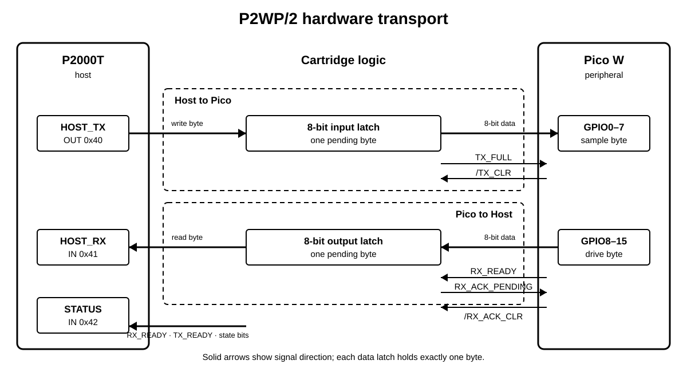

Hardware design
===============

The slot-2 cartridge is a bridge between two systems with different buses and
voltage levels. On one side is the P2000T's 5 V, eight-bit I/O bus. On the
other is the Pico W's 3.3 V GPIO. The cartridge decodes three I/O addresses,
moves one byte in each direction, and provides handshake signals so that a
fast endpoint never outruns a slow one.

This page explains the circuit from functional blocks down to the individual
logic devices. The :doc:`protocol` specifies the software-visible behaviour.

At a glance
-----------

   The two byte paths are independent. ``STATUS`` lets the P2000T determine
   when it may write and when a received byte is available.

The P2000T always initiates a protocol transaction, but bytes can travel in
either direction. A one-byte input register protects Pico-bound data; the Pico
holds host-bound data stable until the P2000T reads it. Separate flip-flops
remember the state of each handshake.

Complete schematic
------------------

.. figure:: ../pcb/p2000t-pico-web-interface.svg
   :alt: Complete black-and-white circuit schematic for the P2000T Pico Web Interface
   :width: 100%

   Complete cartridge circuit. Open the image separately to inspect component
   references, pin numbers, and signal names at full resolution.

The editable design is in the `KiCad schematic`_; a `standalone SVG`_ is also
available. The SVG is generated from that source in black and white.

Address decoding and port strobes
---------------------------------

The P2000T presents address bits, data bits, ``/IORQ``, ``/RD``, ``/WR``, and
``/RES`` on connector **J1**. The cartridge responds only to I/O addresses
``0x40`` through ``0x42``:

.. list-table::
   :header-rows: 1
   :widths: 16 20 24 40

   * - Port
     - Bus operation
     - Internal strobe
     - Selected circuit
   * - ``0x40``
     - Write
     - ``/WRx40``
     - U1 input register and U5A transmit-state flip-flop
   * - ``0x41``
     - Read
     - ``/RDx41``
     - U2 output-bus buffer and U5B receive-acknowledge flip-flop
   * - ``0x42``
     - Read
     - ``/RDx42``
     - U3 status-bus buffer

**U8**, a 74HCT688 equality comparator, recognizes the ``0x4x`` address
range. **U9**, a 74HCT138 decoder, then uses A0 through A2 to select ``0x40``,
``0x41``, or ``0x42``. Gates in **U7** combine those active-low selections
with the P2000T read or write control signal. This produces a strobe only for
the correct port and bus operation.

P2000T-to-Pico data path
-------------------------

#. Software waits until status bit 1, ``TX_READY``, is high.
#. An ``OUT`` to ``0x40`` places D0 through D7 on the P2000T bus and pulses
   ``/WRx40``.
#. **U1**, a 74LVC273 powered at 3.3 V, captures that byte and presents it as
   ``PD0`` through ``PD7`` to Pico GPIO0 through GPIO7.
#. The same write clocks **U5A**. Its outputs assert ``TX_FULL`` and deassert
   ``TX_READY``, recording that U1 contains an unread byte.
#. The Pico samples GPIO0 through GPIO7, then pulses ``/TX_CLR`` low. **U6A**
   combines that signal with reset and clears U5A, making ``TX_READY`` high
   again.

U1 holds the byte independently of the P2000T bus. The host must nevertheless
wait for ``TX_READY`` before every write: a second write would replace the byte
before the Pico had consumed it.

Pico-to-P2000T data path
-------------------------

#. The Pico waits for ``RX_ACK_PENDING`` to be low, then drives GPIO8 through
   GPIO15 (``PD8`` through ``PD15``) and asserts ``RX_READY``.
#. Software observes ``RX_READY`` in status bit 0 and performs an ``IN`` from
   ``0x41``.
#. ``/RDx41`` enables **U2**, a 74HCT245, which drives the Pico byte onto D0
   through D7 for the duration of the read.
#. The end of the read clocks **U5B**, asserting ``RX_ACK_PENDING`` to tell the
   Pico that the byte was accepted.
#. The Pico deasserts ``RX_READY`` and pulses ``/RX_ACK_CLR``. **U6B** then
   clears U5B so another byte can be sent.

There is no second storage register in this direction: the Pico itself keeps
GPIO8 through GPIO15 stable from ``RX_READY`` until the read is acknowledged.
Reading ``0x41`` more than once for the same byte would create an ambiguous
acknowledgement, so the host reads it exactly once.

Status register
---------------

**U3** is another 74HCT245. A read from ``0x42`` enables it and places the
following signals on the P2000T data bus:

.. list-table::
   :header-rows: 1
   :widths: 12 30 58

   * - Bit
     - Signal
     - Source or purpose
   * - 0
     - ``RX_READY``
     - Pico: a host-bound byte is stable
   * - 1
     - ``TX_READY``
     - U5A: U1 can accept another byte
   * - 2
     - ``WIFI_UP``
     - Pico application state
   * - 3
     - ``BUSY``
     - Pico application state
   * - 4
     - ``ERROR``
     - Pico application state
   * - 5
     - ``RX_ACK_PENDING``
     - U5B: the P2000T has read the current byte
   * - 6
     - ``TX_FULL``
     - U5A: U1 contains a Pico-bound byte
   * - 7
     - Ground
     - Reserved; always reads as zero

Only U2 or U3 drives the P2000T data bus, and only during its corresponding
read strobe. At all other times their outputs are high impedance. This avoids
contention with the computer and with other devices on the bus.

Voltage domains, power, and reset
---------------------------------

The cartridge receives 5 V and ground from J1. The 5 V rail powers the Pico
through ``VSYS`` and powers the 74HCT bus-side devices. The Pico's regulated
3.3 V output supplies U1, U5, and U6.

The logic families provide the level boundary. The 3.3 V 74LVC input register
accepts the P2000T's 5 V bus signals and produces 3.3 V GPIO levels. In the
opposite direction, the 5 V 74HCT245 buffers recognize the Pico's 3.3 V output
levels and drive valid 5 V-side bus levels. The control flip-flops and gates
remain in the 3.3 V domain.

**U6C** translates the active-low P2000T reset into ``/RES_3V3`` for the Pico.
Reset also clears the two handshake flip-flops, returning the transport to an
empty, known state. C1 through C3 and C6 through C10 provide local decoupling;
C4 and C5 provide bulk capacitance on the 3.3 V and 5 V rails.

Software-visible guarantees
---------------------------

The circuit deliberately provides only one byte of buffering per direction.
Software and firmware therefore form part of the transport:

* the host must poll ``TX_READY`` before writing and ``RX_READY`` before
  reading;
* the Pico must hold outgoing data stable until it sees
  ``RX_ACK_PENDING``;
* the Pico must acknowledge an incoming byte with ``/TX_CLR``;
* every wait must have a finite timeout; and
* reset discards any byte or frame that was partly transferred.

The :ref:`hardware transport section <hardware-transport>` defines the exact
handshake sequence. The :doc:`basic` and :doc:`assembly` guides show how host
software implements it.

.. _KiCad schematic: https://github.com/ifilot/p2000t-teletekst-cartridge/blob/master/pcb/p2000t-pico-web-interface.kicad_sch
.. _standalone SVG: https://github.com/ifilot/p2000t-teletekst-cartridge/blob/master/pcb/p2000t-pico-web-interface.svg
